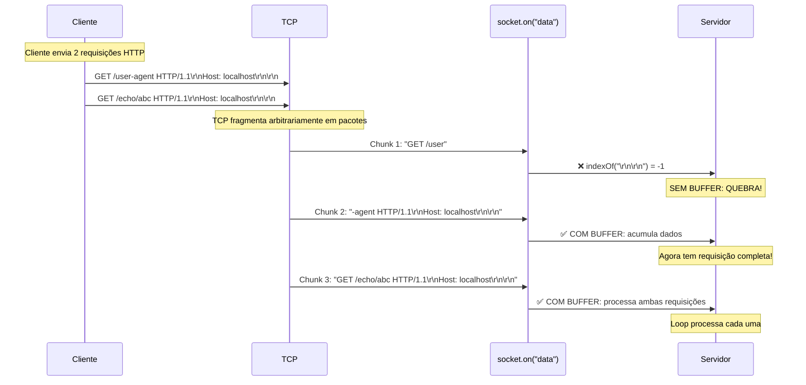

# Diagrama 1: TCP Streaming - O Problema Fundamental

## Como TCP entrega dados (não garante mensagens completas)



## O Problema

TCP é um **STREAM** (fluxo contínuo), não mensagens delimitadas.

- ❌ **Sem Buffer**: Assume que cada evento `data` contém uma requisição completa
- ✅ **Com Buffer**: Acumula dados até ter requisição(ões) completa(s)

## Solução

```typescript
// ❌ ERRADO - Código atual
socket.on("data", (data) => {
  const headerEndIndex = data.indexOf("\r\n\r\n");
  // Assume que 'data' tem requisição completa!
});

// ✅ CORRETO - Com buffer
let buffer = Buffer.alloc(0);
socket.on("data", (chunk) => {
  buffer = Buffer.concat([buffer, chunk]);
  // Acumula até ter requisição completa
});
```