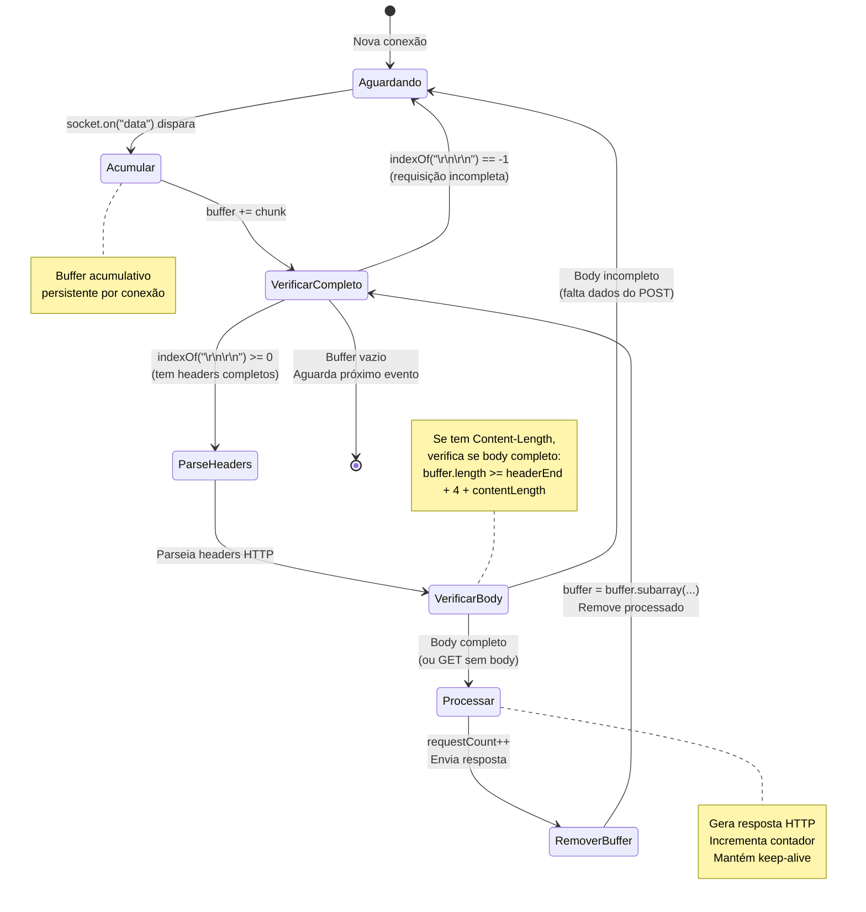

# Diagrama 2: Máquina de Estados do Parser HTTP

## Fluxo de processamento de requisições

## Estados Explicados

1. **Aguardando**: Conexão ociosa, esperando dados
2. **Acumular**: Adiciona chunk recebido ao buffer
3. **VerificarCompleto**: Checa se tem `\r\n\r\n` (fim de headers)
4. **ParseHeaders**: Extrai método, path, headers
5. **VerificarBody**: Se POST/PUT, verifica Content-Length
6. **Processar**: Executa lógica da requisição
7. **RemoverBuffer**: Remove dados processados do buffer

## Loop Contínuo

O estado `VerificarCompleto` volta para si mesmo enquanto houver requisições completas no buffer, permitindo processar múltiplas requisições em um único evento `data`.