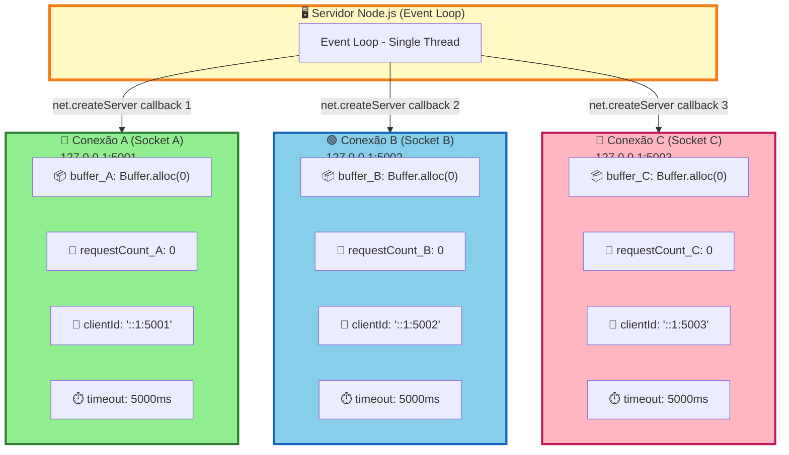

# Diagrama 3: Isolamento de Estado Por Conexão

## Cada conexão tem seu próprio estado independente



## Por que isso funciona?

```typescript
// ✅ CORRETO - Estado isolado por conexão
const server = net.createServer((socket) => {
  // Cada execução deste callback cria um novo escopo!
  let buffer = Buffer.alloc(0);      // ← buffer_A, buffer_B, buffer_C...
  let requestCount = 0;               // ← count_A, count_B, count_C...
  const clientId = `${socket.remoteAddress}:${socket.remotePort}`;

  socket.on("data", (chunk) => {
    buffer = Buffer.concat([buffer, chunk]);  // ← Cada um seu buffer!
    requestCount++;                           // ← Cada um seu contador!
  });
});
```

## ❌ ANTI-PATTERN - Estado Global (NUNCA FAÇA!)

```typescript
// ❌ ERRADO - Estado compartilhado
let buffer = Buffer.alloc(0);  // ← GLOBAL! PERIGO!
let requestCount = 0;          // ← GLOBAL! PERIGO!

const server = net.createServer((socket) => {
  socket.on("data", (chunk) => {
    buffer = Buffer.concat([buffer, chunk]);
    // ❌ TODAS as conexões compartilham o mesmo buffer!
    // Cliente A pode receber dados do Cliente B!
  });
});
```

## Closure JavaScript Garante Isolamento

Cada chamada de `net.createServer(callback)` cria um **closure** novo com suas próprias variáveis locais.

```
Conexão 1 → Closure 1 { buffer_1, requestCount_1 }
Conexão 2 → Closure 2 { buffer_2, requestCount_2 }
Conexão 3 → Closure 3 { buffer_3, requestCount_3 }
```

Totalmente isolados! ✅