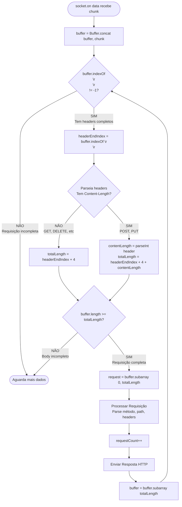

# Diagrama 4: Processamento com Buffer e Loop

## Fluxograma do algoritmo de parsing



## Por que o WHILE é crucial?

Um único evento `data` pode conter **múltiplas requisições completas**:

```
Chunk recebido:
"GET /echo/abc HTTP/1.1\r\nHost: localhost\r\n\r\nGET /user-agent HTTP/1.1\r\nHost: localhost\r\n\r\n"
│←──────────────── Req 1 ────────────────→│←──────────────── Req 2 ────────────────→│
```

### ❌ Sem Loop (processa apenas 1x)

```typescript
socket.on("data", (data) => {
  const index = data.indexOf("\r\n\r\n");
  if (index !== -1) {
    processRequest(data); // ← Processa só primeira!
  }
  // ❌ Segunda requisição PERDIDA!
});
```

### ✅ Com Loop (processa todas)

```typescript
socket.on("data", (chunk) => {
  buffer = Buffer.concat([buffer, chunk]);

  while (buffer.indexOf("\r\n\r\n") !== -1) {
    // ← LOOP!
    // Extrai e processa
    const request = extractRequest(buffer);
    processRequest(request);
    buffer = removeProcessed(buffer);
  }
  // ✅ Todas requisições processadas!
});
```

## Exemplo Prático

```
Estado inicial:
buffer = []

Evento 1: chunk = "GET /echo/abc HTTP/1.1\r\nHost: localhost\r\n\r\nGET /user-agent HTTP/1.1\r\nHost: localhost\r\n\r\n"

buffer = [chunk]

Loop iteração 1:
  indexOf("\r\n\r\n") = 42 ✓
  Extrai: "GET /echo/abc HTTP/1.1\r\nHost: localhost\r\n\r\n"
  Processa e responde
  buffer = "GET /user-agent HTTP/1.1\r\nHost: localhost\r\n\r\n"

Loop iteração 2:
  indexOf("\r\n\r\n") = 46 ✓
  Extrai: "GET /user-agent HTTP/1.1\r\nHost: localhost\r\n\r\n"
  Processa e responde
  buffer = []

Loop iteração 3:
  indexOf("\r\n\r\n") = -1
  Sai do while

✓ Ambas requisições processadas!
```
