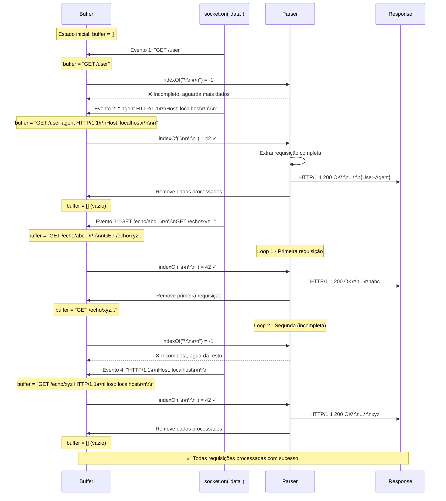

# Diagrama 5: Exemplo Concreto - Fragmentação TCP

## Sequência de eventos com requisições fragmentadas

## Linha do Tempo

| Tempo | Evento | Buffer State | Ação |
|-------|--------|--------------|------|
| t0 | Conexão aberta | `[]` | Aguarda |
| t1 | Chunk 1 | `"GET /user"` | Acumula, aguarda |
| t2 | Chunk 2 | `"GET /user-agent...\r\n\r\n"` | Processa req 1 |
| t3 | Após processar | `[]` | Buffer limpo |
| t4 | Chunk 3 | `"GET /echo/abc...\r\n\r\nGET /echo/xyz..."` | Processa req 2 |
| t5 | Após loop | `"GET /echo/xyz..."` | Aguarda resto |
| t6 | Chunk 4 | `"GET /echo/xyz...\r\n\r\n"` | Processa req 3 |
| t7 | Após processar | `[]` | Buffer limpo |

## Conclusão

O buffer age como um **acumulador resiliente** que:
1. ✅ Acumula fragmentos até ter requisição completa
2. ✅ Processa múltiplas requisições em loop
3. ✅ Mantém dados parciais para próximo evento
4. ✅ Nunca perde dados