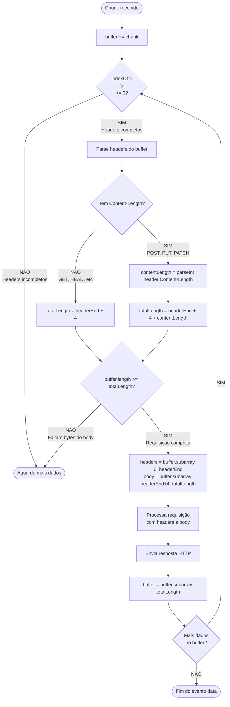
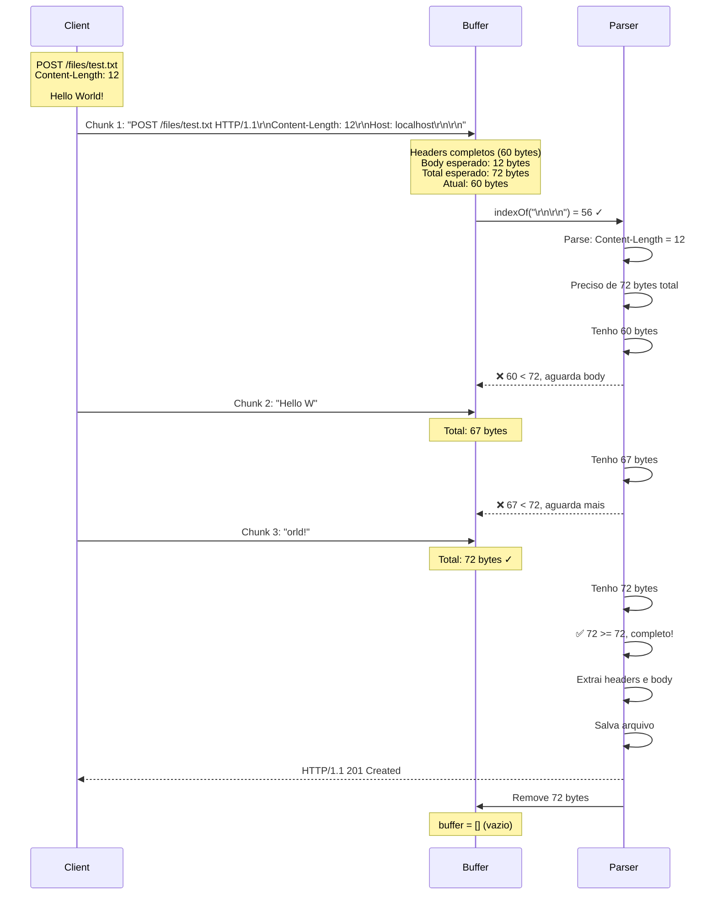

# Diagrama 6: POST com Content-Length

## Fluxograma para requisições com body



## Exemplo: POST com Body Fragmentado



## Cálculo de Bytes

```
┌────────────────────────────────────────────────────────────┐
│ Requisição POST Completa                                   │
├────────────────────────────────────────────────────────────┤
│                                                            │
│ POST /files/test.txt HTTP/1.1\r\n                         │
│ Content-Length: 12\r\n                                     │
│ Host: localhost\r\n                                        │
│ \r\n                               ← headerEnd = 56        │
│ Hello World!                       ← body (12 bytes)       │
│                                                            │
│ ┌──────────────┬────────────────┐                         │
│ │   Headers    │      Body      │                         │
│ │  60 bytes    │   12 bytes     │                         │
│ │ (56 + 4)     │                │                         │
│ └──────────────┴────────────────┘                         │
│                                                            │
│ totalLength = headerEnd + 4 + contentLength                │
│             = 56 + 4 + 12                                  │
│             = 72 bytes                                     │
│                                                            │
│ ✅ Só processa quando buffer.length >= 72                 │
└────────────────────────────────────────────────────────────┘
```

## Código de Exemplo

```typescript
// Processa requisições com Content-Length
while (buffer.indexOf("\r\n\r\n") !== -1) {
  const headerEnd = buffer.indexOf("\r\n\r\n");
  const headerString = buffer.subarray(0, headerEnd).toString();

  // Extrai Content-Length se existir
  const match = headerString.match(/Content-Length: (\d+)/i);

  let totalLength;
  if (match) {
    const contentLength = parseInt(match[1]);
    totalLength = headerEnd + 4 + contentLength;
  } else {
    totalLength = headerEnd + 4; // Sem body
  }

  // Verifica se tem todos os bytes
  if (buffer.length < totalLength) {
    break; // Aguarda mais dados
  }

  // Extrai requisição completa
  const request = buffer.subarray(0, totalLength);
  processRequest(request);

  // Remove do buffer
  buffer = buffer.subarray(totalLength);
}
```

## Por que isso é importante?

Sem verificar `Content-Length`, você pode:

1. ❌ Processar body incompleto
2. ❌ Cortar dados do arquivo
3. ❌ Misturar body de uma requisição com headers da próxima
4. ❌ Corromper dados binários (imagens, PDFs, etc)
