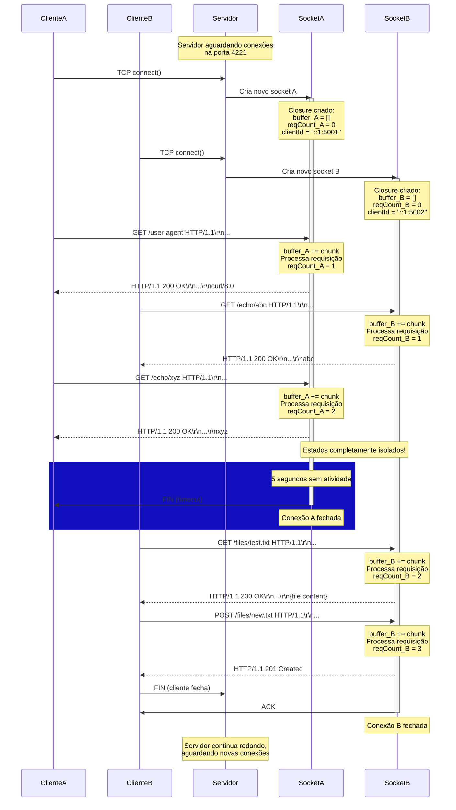

# Diagrama 7: Múltiplas Conexões Simultâneas

## Sequência temporal com 2 clientes simultâneos



## Tabela de Estado ao Longo do Tempo

| Tempo | Conexão A                            | Conexão B                            | Event Loop    |
| ----- | ------------------------------------ | ------------------------------------ | ------------- |
| t0    | -                                    | -                                    | Aguardando    |
| t1    | Socket criado<br/>buffer=[], count=0 | -                                    | Ativo         |
| t2    | buffer=[...], count=0                | Socket criado<br/>buffer=[], count=0 | Ativo         |
| t3    | Processa req 1<br/>count=1           | buffer=[], count=0                   | Processando A |
| t4    | buffer=[], count=1                   | Processa req 1<br/>count=1           | Processando B |
| t5    | Processa req 2<br/>count=2           | buffer=[], count=1                   | Processando A |
| t6    | **TIMEOUT**<br/>Fechado              | buffer=[], count=1                   | Limpou A      |
| t7    | -                                    | Processa req 2<br/>count=2           | Processando B |
| t8    | -                                    | Processa req 3<br/>count=3           | Processando B |
| t9    | -                                    | **Fechado**                          | Limpou B      |

## Comparação: Código Atual vs Código Novo

### ❌ Código Atual (Funciona para 1 conexão por vez)

```typescript
// Já funciona para múltiplas conexões!
net.createServer((socket) => {
  // ✅ Cada socket tem seu escopo
  const clientId = `${socket.remoteAddress}:${socket.remotePort}`;

  socket.on("data", (data) => {
    // ❌ MAS não lida com fragmentação
    // ❌ MAS não processa múltiplas requisições no mesmo data
    processRequest(data);
  });
});
```

### ✅ Código Novo (Funciona para múltiplas conexões + requisições)

```typescript
net.createServer((socket) => {
  // ✅ Estado isolado por conexão
  let buffer = Buffer.alloc(0); // ← Único para esta conexão
  let requestCount = 0; // ← Único para esta conexão
  const clientId = `${socket.remoteAddress}:${socket.remotePort}`;

  socket.on("data", (chunk) => {
    // ✅ Acumula fragmentos
    buffer = Buffer.concat([buffer, chunk]);

    // ✅ Processa todas as requisições completas
    while (buffer.indexOf("\r\n\r\n") !== -1) {
      const request = extractRequest(buffer);
      processRequest(request);
      requestCount++;
      buffer = removeProcessed(buffer);
    }
  });
});
```

## Teste com curl --next

O comando que você mencionou testa exatamente isso:

```bash
curl --http1.1 -v \
  http://localhost:4221/user-agent \
  -H "User-Agent: orange/mango-grape" \
  --next \
  http://localhost:4221/echo/apple
```

O `--next` faz curl criar **2 conexões separadas**:

- **Conexão 1**: GET /user-agent
- **Conexão 2**: GET /echo/apple

Seu servidor precisa:

1. ✅ Aceitar ambas conexões simultaneamente
2. ✅ Processar cada uma independentemente
3. ✅ Manter estado separado (buffer, requestCount)
4. ✅ Responder corretamente para cada uma

## Conclusão

Node.js já fornece **isolamento de conexões** gratuitamente via closures.

O que precisamos adicionar:

1. **Buffer acumulativo** por conexão
2. **Loop** para processar múltiplas requisições
3. **Content-Length** para requisições POST
4. **Contador** para rastrear requisições por conexão
