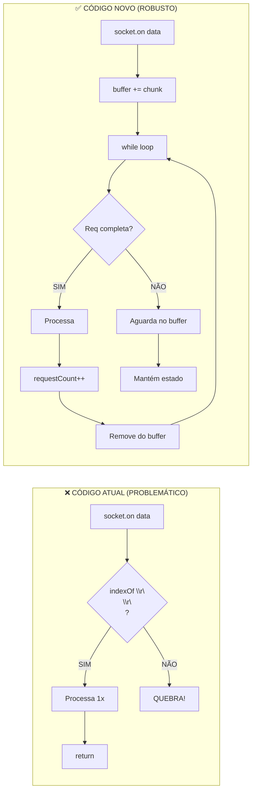
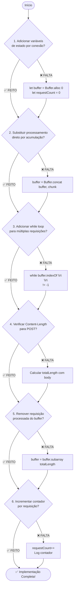
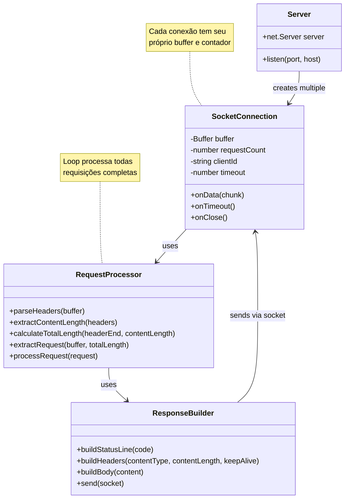

# Diagrama 8: Resumo da Implementação

## Antes vs Depois - Comparação Visual



## Checklist de Implementação



## Estrutura Final do Código



## Alterações Necessárias no main.ts

### Localização das Mudanças

```
app/main.ts
│
├─ Linha 26: net.createServer((socket) => {
│  │
│  ├─ [ADICIONAR] Linha 27: let buffer = Buffer.alloc(0);
│  ├─ [ADICIONAR] Linha 28: let requestCount = 0;
│  │
│  ├─ Linha 38: socket.on("data", (data) => {
│  │  │
│  │  ├─ [MUDAR] data → chunk
│  │  ├─ [ADICIONAR] buffer = Buffer.concat([buffer, chunk]);
│  │  ├─ [ADICIONAR] while (buffer.indexOf("\r\n\r\n") !== -1) {
│  │  │
│  │  ├─ Linha 39-45: [MOVER PARA DENTRO DO WHILE]
│  │  │  └─ Parse headers, method, path
│  │  │
│  │  ├─ [ADICIONAR] Verificação Content-Length
│  │  ├─ [ADICIONAR] Cálculo totalLength
│  │  ├─ [ADICIONAR] Check buffer.length >= totalLength
│  │  │
│  │  ├─ Linha 53-189: [MANTER] Lógica de rotas
│  │  │  └─ Mas processar do buffer, não do data
│  │  │
│  │  ├─ [ADICIONAR] requestCount++
│  │  ├─ [ADICIONAR] buffer = buffer.subarray(totalLength)
│  │  │
│  │  └─ [ADICIONAR] } // fim do while
│  │
│  └─ Linha 192: socket.on("close", ...
│
└─ Linha 198: server.listen(4221, "localhost");
```

## Resumo dos Benefícios

| Problema                     | Solução               | Benefício                |
| ---------------------------- | --------------------- | ------------------------ |
| Requisição fragmentada       | Buffer acumulativo    | ✅ Nunca perde dados     |
| Múltiplas req no mesmo chunk | While loop            | ✅ Processa todas        |
| POST com body incompleto     | Content-Length check  | ✅ Aguarda body completo |
| Estado compartilhado         | Variáveis por closure | ✅ Conexões isoladas     |
| Não rastreia requisições     | requestCount++        | ✅ Métricas e limites    |

## Próximos Passos

1. ✅ Estudar diagramas (CONCLUÍDO!)
2. 🔄 Implementar buffer e loop (PRÓXIMO)
3. ⏳ Testar com curl --next
4. ⏳ Verificar logs e contadores
5. ⏳ Testar fragmentação manualmente

Pronto para começar a implementação? 🚀
